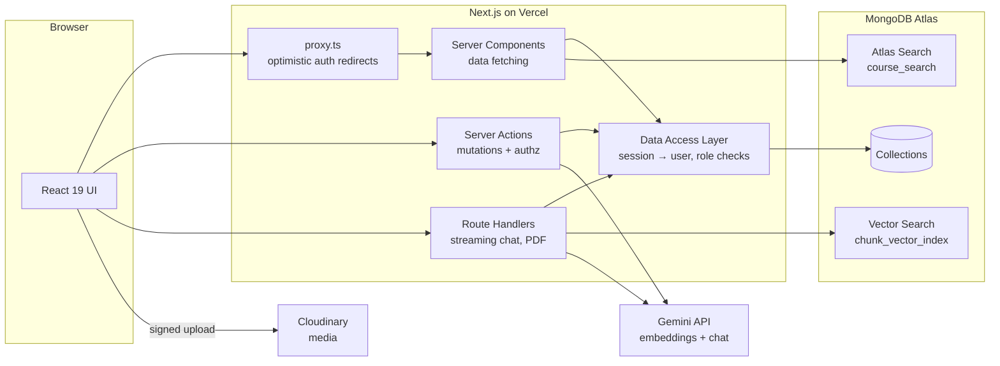

# EduMind — AI-Powered Learning Platform

A full-stack learning management system where **every course comes with its own AI tutor**. Students ask questions and get answers **grounded in that course's lessons** (Retrieval-Augmented Generation with MongoDB Atlas Vector Search + Google Gemini), with links to the source lessons. Instructors build courses, generate quizzes with AI in one click, and students earn verifiable PDF certificates.

Built with **Next.js 16 (App Router, React 19, Server Actions)**, **TypeScript**, **MongoDB Atlas**, and **Tailwind CSS** — and runs entirely on free tiers.

---

## Features

**Students**
- Browse and search the catalog (typo-tolerant **Atlas Search**, category/level filters, sorting, pagination)
- Enroll, then learn in a lesson player (video, Markdown articles, PDFs) that resumes where you left off
- **AI Tutor** per course — streaming answers grounded in the course content, with inline citations and source-lesson links
- Quizzes with instant, server-side grading and explanations
- Progress tracking, course reviews and ratings
- **Certificates** on completion: a public verification page and a generated PDF

**Instructors**
- Course builder: sections, lessons (YouTube/MP4 video, article, PDF), one-click reordering, free-preview lessons
- Direct-to-Cloudinary uploads with progress (files never pass through the server)
- **AI quiz generation** from lesson content (Gemini structured JSON output, validated with Zod)
- Automatic background re-indexing of lesson content for the AI tutor on every save
- Publishing checklist and per-course stats

**Admins**
- Platform dashboard: users, courses, enrollments, certificates, AI usage, 30-day enrollment chart
- User search and role management, course moderation (unpublish / delete with cascading cleanup)

## Architecture



### How the AI tutor works (RAG)

1. **Indexing** — when an instructor saves a lesson, its text is split into ~1,200-character overlapping chunks (`src/lib/ai/chunk.ts`), embedded with `gemini-embedding-001` (768 dimensions), and stored in the `contentchunks` collection. This runs in the background with Next.js `after()` so saving stays instant.
2. **Retrieval** — a student's question is embedded, and `$vectorSearch` finds the top-5 most similar chunks **filtered to that course** (`src/lib/ai/rag.ts`). Without Atlas (e.g. local MongoDB), it falls back to exact cosine similarity in app code.
3. **Generation** — the chunks are numbered and placed in the system prompt together with the lesson the student is viewing and the last few chat turns. Gemini streams the answer back through a Route Handler; the client renders Markdown as it arrives.
4. **Guardrails** — enrollment check, 30 questions/hour rate limit per user, 2,000-character limit, prompt-injection instructions, and sources shown only for strong matches.

### Data model

| Collection | Purpose | Notable design choices |
|---|---|---|
| `users` | accounts & roles | bcrypt hashes, `select: false` on the hash |
| `courses` | course metadata | **embedded** sections; **denormalized** stats (lessons, minutes, enrollments, rating) |
| `lessons` | lesson content | **referenced** (content can be large); compound index `{course, section, order}` |
| `enrollments` | progress | unique `{user, course}`; sparse unique `certificateCode` |
| `reviews` | ratings | unique `{user, course}`; course rating recomputed with an aggregation |
| `contentchunks` | RAG chunks + vectors | Atlas Vector Search index with a `course` filter field |
| `quizzes` / `quizattempts` | quizzes & results | answers never sent to the client before submission |
| `chatmessages` | tutor history | index `{user, course, createdAt}` (also used for rate limiting) |

### Security

- Custom session auth: HS256-signed JWT in an `httpOnly`, `sameSite=lax` cookie (`jose`), bcrypt (cost 12)
- Defense in depth: `proxy.ts` does optimistic redirects, but **every page, Server Action and Route Handler re-checks the user and role against the database** (a demoted user with an old cookie is rejected — covered by tests)
- Ownership checks on every course/lesson mutation; admins can't change their own role; users can't self-register as admin
- All input validated with Zod; open-redirect protection on login; regex input escaped; Markdown rendered without raw HTML
- Quiz answer keys stay on the server; certificate codes are random and verifiable publicly

## Tech stack

| Area | Choice |
|---|---|
| Framework | Next.js 16 (App Router, Server Components, Server Actions, `proxy.ts`, `after()`) |
| UI | React 19, Tailwind CSS 4, lucide icons, sonner toasts, react-markdown |
| Database | MongoDB Atlas (M0 free tier) + Mongoose 9 |
| Search | Atlas Search (full-text, fuzzy) and Atlas Vector Search |
| AI | Google Gemini API (chat, structured output, embeddings) via REST |
| Media | Cloudinary (signed direct uploads) |
| PDFs | pdf-lib |
| Testing | Vitest (unit) + an end-to-end suite (in-memory MongoDB, mock Gemini, production build) |
| CI | GitHub Actions |

## Getting started

### 1. Prerequisites (all free)

| Service | What to do |
|---|---|
| [MongoDB Atlas](https://www.mongodb.com/cloud/atlas/register) | Create an **M0** cluster → *Database Access*: add a user → *Network Access*: allow `0.0.0.0/0` → *Connect → Drivers*: copy the connection string |
| [Google AI Studio](https://aistudio.google.com/apikey) | Create a Gemini API key |
| [Cloudinary](https://cloudinary.com) *(optional)* | Copy cloud name, API key and secret. Without it, instructors can paste video/image/PDF URLs instead |

Node.js 22+ is required.

### 2. Configure

```bash
npm install
cp .env.example .env.local   # then fill in the values
```

Generate a session secret with:

```bash
node -e "console.log(require('crypto').randomBytes(32).toString('base64'))"
```

### 3. Create indexes and demo data

```bash
npm run setup:indexes   # regular indexes + Atlas Search + Vector Search indexes
npm run seed            # demo users, 3 published courses, quizzes, AI index
```

Demo accounts created by the seed script:

| Role | Email | Password |
|---|---|---|
| Admin | admin@edumind.dev | Admin12345 |
| Instructor | instructor@edumind.dev | Teach12345 |
| Student | student@edumind.dev | Learn12345 |

### 4. Run

```bash
npm run dev     # http://localhost:3000
```

## Scripts

| Command | Description |
|---|---|
| `npm run dev` | Start the dev server |
| `npm run build` / `npm start` | Production build / server |
| `npm run lint` | ESLint |
| `npm run typecheck` | Generate route types and run `tsc` |
| `npm test` | Unit tests (Vitest) |
| `npm run test:e2e` | End-to-end suite (run `npm run build` first) |
| `npm run setup:indexes` | Create/update MongoDB and Atlas search indexes |
| `npm run seed` | Insert demo data (idempotent) |

## Testing

- **Unit tests** (`tests/unit`) cover chunking, cosine similarity, YouTube URL parsing, slugs and formatting.
- **End-to-end suite** (`tests/e2e/run.mjs`, ~95 checks) boots the **production build** against an **in-memory MongoDB** and a **mock Gemini server**, then drives every feature over HTTP exactly like the browser does (including Server Actions): auth, authorization edge cases, the course builder, background AI indexing, AI quiz generation, catalog search, enrollment, the lesson player, quizzes, the streaming RAG chat (grounding, citations, history, rate limiting), reviews, progress, certificates (page + PDF), admin tools, and cascade deletes. It runs in CI on every push, free and deterministic.

## Deploying to Vercel (free)

1. Push this repository to GitHub.
2. Import it at [vercel.com/new](https://vercel.com/new).
3. Add the environment variables from `.env.example` (`MONGODB_URI`, `SESSION_SECRET`, `GEMINI_API_KEY`, Cloudinary keys, and `NEXT_PUBLIC_APP_URL` set to your Vercel URL).
4. Deploy. Run `npm run setup:indexes` and `npm run seed` once from your machine against the same database.

## Project structure

```
src/
  app/
    (auth)/            login & register
    actions/           Server Actions (auth, courses, lessons, enrollments, quizzes, reviews, ai, admin, upload)
    api/               Route Handlers: streaming AI chat, certificate PDF
    courses/           catalog + course pages
    learn/             lesson player (sidebar, quiz, AI tutor)
    instructor/        course builder
    admin/             admin dashboard
    certificates/      public verification page
  components/          UI primitives and shared components
  lib/
    ai/                Gemini client, chunking, RAG (indexing + retrieval)
    dal.ts             data access layer (session → user, role checks)
    session.ts         JWT cookie sessions
    catalog.ts         Atlas Search with regex fallback
  models/              Mongoose schemas
  proxy.ts             optimistic route protection
scripts/               seed data and index setup
tests/                 unit + end-to-end tests
```

